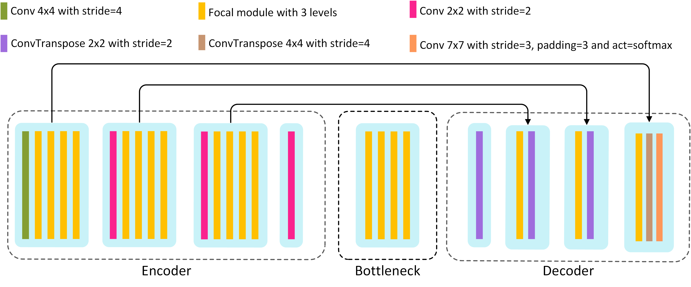
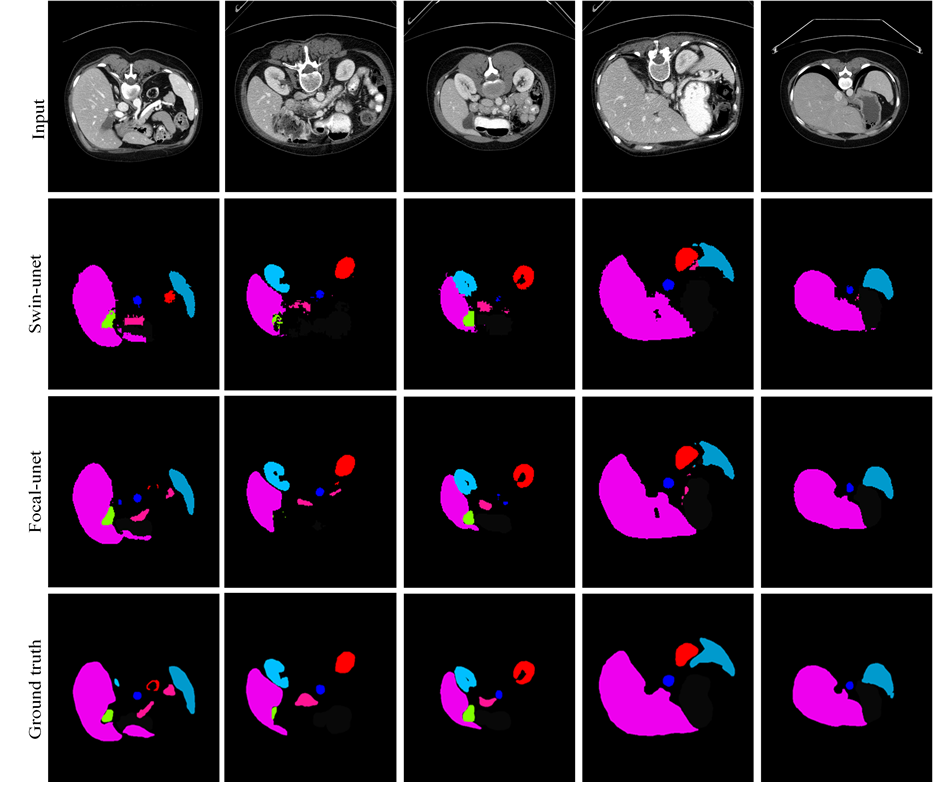
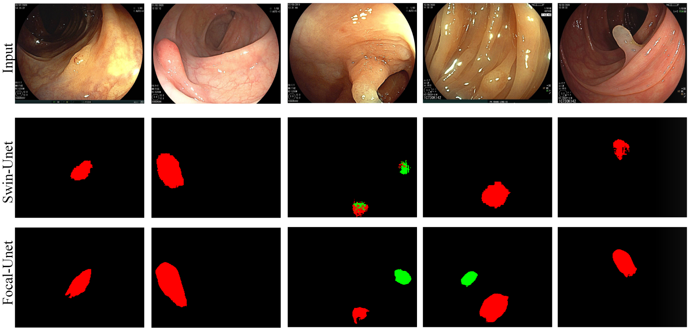

# Focal-Unet: Unet-like Focal Modulation for Medical Image Segmentation

<br>

## Model Architecture
<div  align="center">
    
</div>
<p align="center" "font-size:14px;">
Overview of the Focal-UNet architucture
</p>

---

## Results
<br>
<div  align="center">
    
</div>
<p align="center" "font-size:14px;">
The segmentation results of Swin-UNet and Focal-UNet on Synapse dataset
</p>

<br>

<div  align="center">
<!--      -->
</div>
<p align="center" "font-size:14px;">
The segmentation results of Swin-UNet and Focal-UNet on NeoPolyp dataset
</p>
<br>

---

##  Environment

- Use the command "pip install -r requirements.txt" for install dependencies.
<br>

## Prepare data

- Synapse dataset: https://drive.google.com/file/d/1Vc6Hzjxx1AvE7GSRzNAmgOZtj670dzbl/view

- NeoPolyp dataset: Download Link [Kaggle](https://www.kaggle.com/c/bkai-igh-neopolyp/) 

<br>

## Download pre-trained model 

- The pre-trained model on Synapse dataset is available at: [google drive](https://drive.google.com/file/d/15mlcmLFVxXTNsa0VMfyP6g8kWN7GiRz5/view?usp=sharing).
<br>

## Test

- Put the pre-trained model in `./checkpoint`.

- Run

```bash
python test.py
```
<br>

## Train

- Download pre-trained focalnet tiny lrf from [here](https://drive.google.com/drive/folders/13SecOXT1cSAZpvzgkZ36ug9giwg9VRHb?usp=sharing). Put it in `./pretrained_focal` folder.

- Put Synapse dataset in `./data/Synapse`.

- Run train.py on synapse dataset.

```bash
python train.py
```

<br>

## Acknowledgments

<br>

**Title:** [Focal-UNet: UNet-like Focal Modulation for Medical Image Segmentation](https://arxiv.org/abs/2212.09263)

**Authors:** MohammadReza Naderi, MohammadHossein Givkashi, Fatemeh Piri, Nader Karimi, Shadrokh Samavi

**Journal:** arXiv preprint arXiv:2212.09263

**Year:** 2022 .

